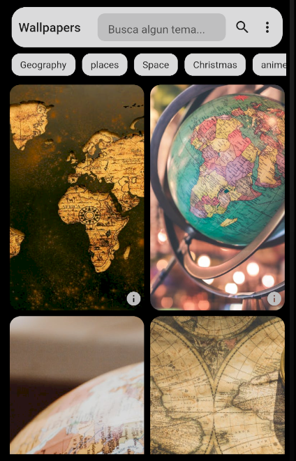

# wallappy

Simple app for set your wallpaper device and download awesome wallpapers images.
This app was created using flutter and integrating java native code and dart "MethodChannels" 

## Getting Started

Just git clone and update the proyect with flutter pub get
